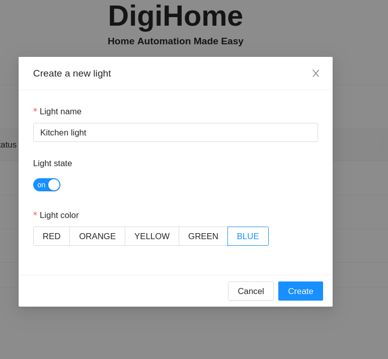
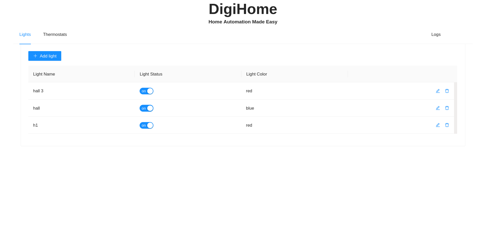
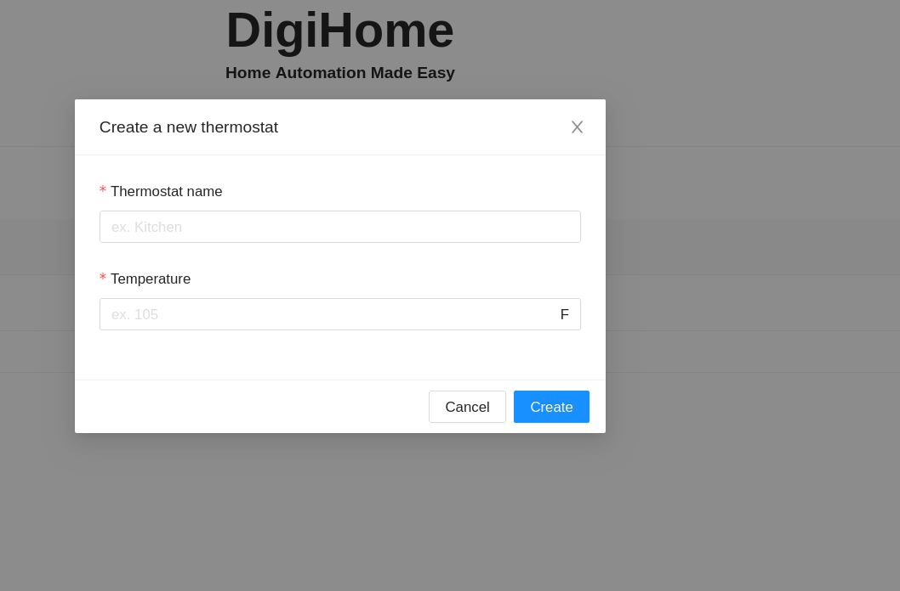
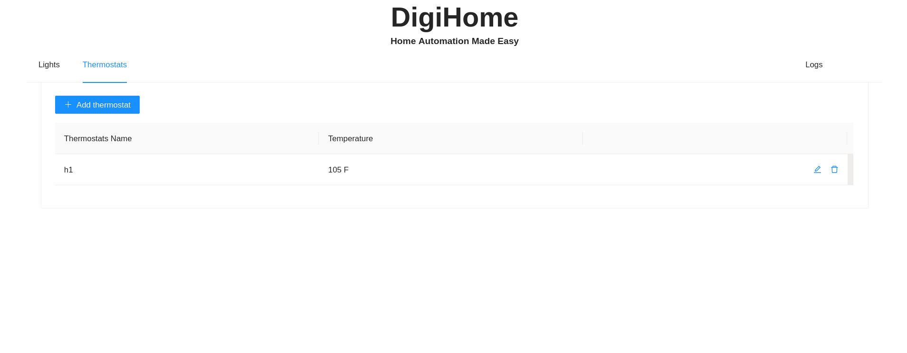
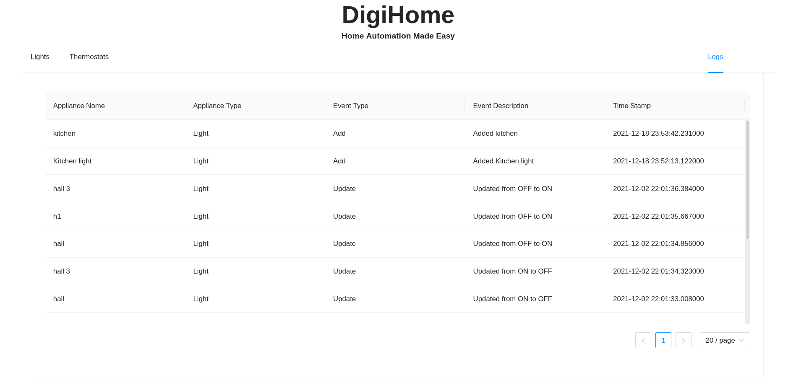

# DigiHome App
## A simple home automation app to manage all your home lights and thermostats

A simple Flask based Home Automation app where users can add, update and remove their home lights and thermostats information. Very simple and very easy to use application, useful for keeping track of your day-to-day home automation tasks.

#### Contains two main modules
- Ligt Module: Manage light states
- Thermostats Module: Manage thermostats states

## Features

- Developed using Powerful Flask, MongoDB and Python
- Simple, fast, secured and easy to use application
- Add your light/thermostats details
- Modify the existing light details (change light status, light color)
- Modify the existing thermostats details (change thermostat temperature)
- Delete the exisitng light/thermostats
- View all the logs easily
- Very flexible Flask APIs
- Can be hosted easily in cloud


## Tech

Dillinger uses a number of open source projects to work properly:

- [Flask] - Powerful Python Based Web Framework
- [MongoDB] - NoSQL based Database
- [React] - a Powerful Javascript Based Web Framework for frontend
- [Docker] - containerization tool


## Installation

DigiHome App requires [Python](https://python.org/) v3.5+ to run.

Install MongoDB using Docker (Docker and Docker Compose needs to be installed first)
```sh
cd DigiHome/backend
docker-compose up -d
```

Clone the repository first
```sh
git clone https://github.com/bickkysahani/DigiHome.git
```
and then
for backend
```sh
cd backend
# install requirements/libraries
pip install -r requirements.txt
# run project
python app.py
```

for frontend

```sh
cd frontend
# install requirements/libraries
npm install
#run project
npm run dev

```
## Screenshots







  
## API Docs

#### Lights APIs:
###### User List API
Path: /add_light <br>
Method: POST <br>
Request:
```
{
    "light_name": "Light 1",
    "light_state": true,
    "light_color": "red"
}

```
Response:
```
{
    "id": "61bee506f271fa32332766d9",
    "message": "Lights created successfully",
    "success": true
}
```


Path: /list_lights <br>
Method: GET <br>

Request: 
```

```
Response:
```
[
  {
    "created_on": "Nov 30 2021 10:06:35", 
    "id": "61a6682b51cbc70a83d04bbc", 
    "light_color": "red", 
    "light_name": "h1", 
    "light_state": true
  }
]
```

Path: /update_light <br>
Method: POST <br>
Request:
```
{
    "id": "61bee506f271fa32332766d9",
    "light_state": false
}
```
Response:
```
{
    "id": "61bee506f271fa32332766d9",
    "message": "Light updated successfully"
}

```
Path : /delete_light/<light_id> <br>
Method: DELETE <br>
Request:
```
{
    "id": "61bee506f271fa32332766d9"
}
```
Response:
```
{
    "id": "61bee506f271fa32332766d9",
    "message": "Light deleted successfully"
}
```


#### Thermostats APIs:
Path: /add_thermostat <br>
Method: POST <br>
Request:
```
{
    "thermostat_name": "T1",
     "temperature": "104"
     
}

```
Response:
```
{
    "id": "61beeac2f271fa32332766e1",
    "message": "Thermostat created successfully",
    "success": true
}
```


Path: /list_thermostat <br>
Method: GET <br>

Request: 
```

```
Response:
```
[
    {
        "created_on": "Dec 19 2021 00:18:10",
        "id": "61beeac2f271fa32332766e1",
        "temperature": "104",
        "thermostat_name": "T1"
    },
    {
        "created_on": "Nov 30 2021 10:15:38",
        "id": "61a66a4a51cbc70a83d04bbe",
        "temperature": "105",
        "thermostat_name": "h1"
    }
]
```

Path: /update_thermostat <br>
Method: POST <br>
Request:
```
{
    "id": "61a66a4a51cbc70a83d04bbe",
    "temperature": "90"
}
```
Response:
```
{
    "id": "61a66a4a51cbc70a83d04bbe",
    "message": "Thermostat updated successfully"
}

```
Path : /delete_thermostat/<thermostat_id> <br>
Method: DELETE <br>
Request:
```
{
    "id": "61a66a4a51cbc70a83d04bbe"
}
```
Response:
```
{
    "id": "61a66a4a51cbc70a83d04bbe",
    "message": "Thermostat deleted successfully"
}
```


### Logs
Path: /logs <br>
Method: GET <br>

Request:
```
```

Response:
```
[
    {
        "applianceName": "h1",
        "applianceType": "Thermostat",
        "createdOn": "2021-12-19 00:23:44.720000",
        "description": "Deleted thermostat h1",
        "eventType": "Delete",
        "id": "61beec10f271fa32332766e5"
    },
    {
        "applianceName": "h1",
        "applianceType": "Thermostat",
        "createdOn": "2021-12-19 00:22:04.739000",
        "description": "Updated from 105 to 90",
        "eventType": "Update",
        "id": "61beebacf271fa32332766e4"
    },
    ......
   
    
]

```